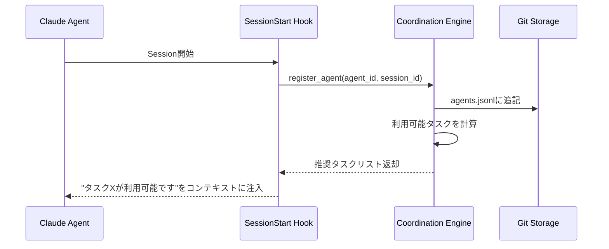
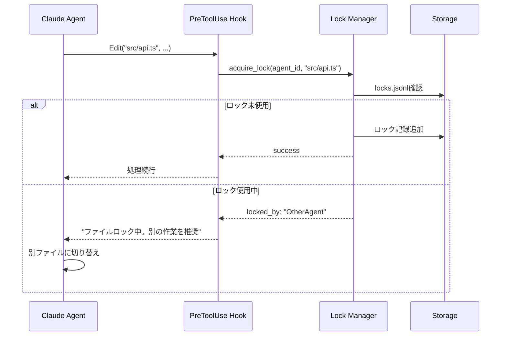
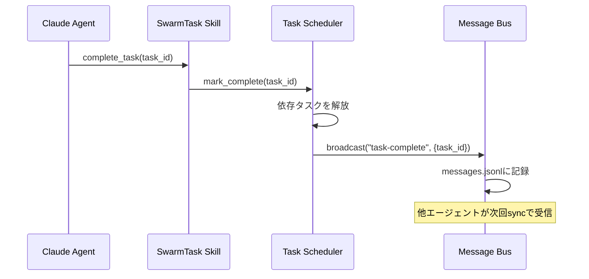

# Multi-Agent Coordinator: 詳細設計

## 設計目標

### 主要原則

1. **Non-Invasive（非侵襲性）**
   - プロジェクトコードに一切の変更を加えない
   - 設定は`.claude/`ディレクトリに集約
   - 既存の開発ワークフローを妨げない

2. **Thin Workflow（薄いワークフロー）**
   - エージェントは通常通り動作、調整は透過的
   - 明示的なコマンド実行を最小化
   - 自動化テストのように「存在を意識させない」

3. **Git-Native（Git統合）**
   - すべてのメタデータをGit管理可能
   - マージフレンドリーなデータフォーマット
   - ブランチ戦略との自然な統合

4. **Plugin-First（プラグイン優先）**
   - Claude Codeの公式プラグイン機構を最大活用
   - フック・スキル・MCPの適材適所
   - 将来的にプラグインマーケットプレイスで配布可能

## アーキテクチャ詳細

### レイヤー構成

```
┌─────────────────────────────────────────────────────────────┐
│ User Interface Layer                                        │
│  - claude-code CLI（通常使用）                                │
│  - Observability Dashboard（オプション）                      │
└───────────────────┬─────────────────────────────────────────┘
                    │
┌───────────────────▼─────────────────────────────────────────┐
│ Plugin Layer (Claude Code Extensions)                       │
│  ┌──────────────┐  ┌──────────────┐  ┌──────────────┐      │
│  │    Hooks     │  │    Skills    │  │ MCP Server   │      │
│  │              │  │              │  │              │      │
│  │ • PreToolUse │  │ • SwarmTask  │  │ • Messaging  │      │
│  │ • PostToolUse│  │ • SwarmSync  │  │ • TaskQueue  │      │
│  │ • SessionStart│  │ • SwarmLock  │  │ • StateQuery │      │
│  │ • SessionEnd │  │              │  │              │      │
│  └──────┬───────┘  └──────┬───────┘  └──────┬───────┘      │
│         │                  │                  │              │
└─────────┼──────────────────┼──────────────────┼──────────────┘
          │                  │                  │
┌─────────▼──────────────────▼──────────────────▼──────────────┐
│ Coordination Engine (Core Logic)                             │
│  ┌─────────────────┐  ┌─────────────────┐  ┌──────────────┐ │
│  │  Lock Manager   │  │  Task Scheduler │  │  Message Bus │ │
│  │                 │  │                 │  │              │ │
│  │ • Acquire       │  │ • Assignment    │  │ • Send/Recv  │ │
│  │ • Release       │  │ • Dependencies  │  │ • Broadcast  │ │
│  │ • TTL Cleanup   │  │ • Priority      │  │ • History    │ │
│  └────────┬────────┘  └────────┬────────┘  └──────┬───────┘ │
│           │                     │                   │         │
└───────────┼─────────────────────┼───────────────────┼─────────┘
            │                     │                   │
┌───────────▼─────────────────────▼───────────────────▼─────────┐
│ Storage Layer                                                 │
│  ┌──────────────────────────────┐  ┌──────────────────────┐  │
│  │  Git-Backed Storage          │  │  SQLite Cache        │  │
│  │                              │  │                      │  │
│  │  .claude/swarm/              │  │  .claude/swarm/      │  │
│  │  ├── agents.jsonl            │  │  └── .cache/         │  │
│  │  ├── tasks.jsonl             │  │      └── state.db    │  │
│  │  ├── locks.jsonl             │  │                      │  │
│  │  └── messages.jsonl          │  │  (.gitignored)       │  │
│  │                              │  │                      │  │
│  │  (Git管理, 監査可能)          │  │  (高速クエリ)         │  │
│  └──────────────────────────────┘  └──────────────────────┘  │
└───────────────────────────────────────────────────────────────┘
```

### データフロー

#### 1. エージェント起動時（SessionStart Hook）



#### 2. ファイル編集時（PreToolUse Hook）



#### 3. タスク完了時（Skill呼び出し）



## コンポーネント詳細

### 1. Hooks Layer

#### SessionStart Hook

**責務**: エージェント登録と初期化

```python
# .claude/hooks/session-start.py
import json
import uuid
from datetime import datetime
from pathlib import Path

def handle_session_start(session_id: str, context: dict):
    """セッション開始時の処理"""
    swarm_dir = Path(".claude/swarm")
    swarm_dir.mkdir(parents=True, exist_ok=True)

    # エージェントID生成（環境変数 or ユーザー指定 or 自動生成）
    agent_id = (
        context.get("agent_name") or
        f"agent-{uuid.uuid4().hex[:8]}"
    )

    # エージェント登録
    agent_record = {
        "id": agent_id,
        "session_id": session_id,
        "started_at": datetime.utcnow().isoformat(),
        "capabilities": context.get("capabilities", []),
    }

    # agents.jsonlに追記（append-only）
    with open(swarm_dir / "agents.jsonl", "a") as f:
        f.write(json.dumps(agent_record) + "\n")

    # 利用可能タスク取得
    from coordination import get_available_tasks
    tasks = get_available_tasks(agent_id)

    # コンテキスト注入用メッセージ返却
    if tasks:
        task_list = "\n".join(f"- {t['id']}: {t['description']}" for t in tasks)
        return {
            "context_message": f"""
## Swarm Coordination Info

You are agent **{agent_id}** in a multi-agent swarm.

**Available tasks**:
{task_list}

To claim a task: use the `swarm_claim_task` tool.
To message other agents: use the `swarm_send_message` tool.
"""
        }

    return {}
```

#### PreToolUse Hook

**責務**: ファイルロック取得

```python
# .claude/hooks/pre-tool-use.py
import json
from pathlib import Path
from datetime import datetime, timedelta

LOCK_TIMEOUT = timedelta(minutes=5)

def handle_pre_tool_use(tool_name: str, params: dict, agent_id: str):
    """ツール使用前のロック確認・取得"""
    # ファイル編集系ツールのみ対象
    if tool_name not in ["Edit", "Write", "MultiEdit"]:
        return {"block": False}

    file_path = params.get("file_path")
    if not file_path:
        return {"block": False}

    # ロック状態確認
    lock_info = check_lock(file_path)

    if lock_info and lock_info["holder"] != agent_id:
        # 他エージェントがロック保持中
        time_remaining = lock_info["expires_at"] - datetime.utcnow()

        return {
            "block": True,
            "message": f"""
File **{file_path}** is currently locked by agent **{lock_info['holder']}**.

Reason: {lock_info.get('reason', 'editing')}
Time remaining: {time_remaining.seconds // 60} minutes

**Suggestions**:
- Work on a different file in the meantime
- Send a message to {lock_info['holder']} to coordinate
- Wait for lock to expire
"""
        }

    # ロック取得
    acquire_lock(
        agent_id=agent_id,
        file_path=file_path,
        reason=f"editing via {tool_name}",
        ttl=LOCK_TIMEOUT
    )

    return {"block": False}

def check_lock(file_path: str) -> dict | None:
    """現在のロック状態を確認"""
    locks_file = Path(".claude/swarm/locks.jsonl")
    if not locks_file.exists():
        return None

    # 最新のロック記録を検索（逆順スキャン）
    with open(locks_file, "r") as f:
        lines = f.readlines()

    for line in reversed(lines):
        record = json.loads(line)
        if record["file_path"] == file_path:
            # TTL確認
            expires_at = datetime.fromisoformat(record["expires_at"])
            if expires_at > datetime.utcnow():
                return record
            else:
                # 期限切れ
                return None

    return None

def acquire_lock(agent_id: str, file_path: str, reason: str, ttl: timedelta):
    """ロック取得を記録"""
    lock_record = {
        "file_path": file_path,
        "holder": agent_id,
        "reason": reason,
        "acquired_at": datetime.utcnow().isoformat(),
        "expires_at": (datetime.utcnow() + ttl).isoformat(),
    }

    locks_file = Path(".claude/swarm/locks.jsonl")
    with open(locks_file, "a") as f:
        f.write(json.dumps(lock_record) + "\n")
```

#### PostToolUse Hook

**責務**: ロック解放（明示的）

```python
# .claude/hooks/post-tool-use.py
def handle_post_tool_use(tool_name: str, params: dict, result: dict, agent_id: str):
    """ツール使用後の処理"""
    if tool_name in ["Edit", "Write", "MultiEdit"]:
        file_path = params.get("file_path")
        if file_path and result.get("success"):
            # 編集成功時にロック解放
            release_lock(agent_id, file_path)

    return {}

def release_lock(agent_id: str, file_path: str):
    """ロック解放を記録"""
    lock_record = {
        "file_path": file_path,
        "holder": agent_id,
        "released_at": datetime.utcnow().isoformat(),
        "status": "released"
    }

    locks_file = Path(".claude/swarm/locks.jsonl")
    with open(locks_file, "a") as f:
        f.write(json.dumps(lock_record) + "\n")
```

### 2. MCP Server

軽量なMCPサーバーでエージェント間通信を提供。

#### ツール定義

```typescript
// mcp-server/src/tools.ts
import { Tool } from "@modelcontextprotocol/sdk/types.js";

export const tools: Tool[] = [
  {
    name: "swarm_send_message",
    description: "Send a message to another agent or broadcast to all agents",
    inputSchema: {
      type: "object",
      properties: {
        recipient: {
          type: "string",
          description: "Agent ID or 'all' for broadcast",
        },
        subject: {
          type: "string",
          description: "Message subject",
        },
        body: {
          type: "string",
          description: "Message content",
        },
        priority: {
          type: "string",
          enum: ["low", "normal", "high"],
          default: "normal",
        },
      },
      required: ["recipient", "body"],
    },
  },
  {
    name: "swarm_get_messages",
    description: "Get messages sent to this agent",
    inputSchema: {
      type: "object",
      properties: {
        unread_only: {
          type: "boolean",
          default: true,
        },
        limit: {
          type: "number",
          default: 20,
        },
      },
    },
  },
  {
    name: "swarm_claim_task",
    description: "Claim a task from the task queue",
    inputSchema: {
      type: "object",
      properties: {
        task_id: {
          type: "string",
          description: "Task ID to claim (optional, will auto-assign if omitted)",
        },
      },
    },
  },
  {
    name: "swarm_complete_task",
    description: "Mark a task as completed",
    inputSchema: {
      type: "object",
      properties: {
        task_id: {
          type: "string",
        },
        summary: {
          type: "string",
          description: "Completion summary",
        },
      },
      required: ["task_id"],
    },
  },
  {
    name: "swarm_get_state",
    description: "Query current swarm state (agents, tasks, locks)",
    inputSchema: {
      type: "object",
      properties: {
        query_type: {
          type: "string",
          enum: ["agents", "tasks", "locks", "all"],
          default: "all",
        },
      },
    },
  },
];
```

#### 実装例

```typescript
// mcp-server/src/handlers/messaging.ts
import { readFileSync, appendFileSync } from "fs";
import { join } from "path";

const SWARM_DIR = ".claude/swarm";

export async function handleSendMessage(params: any, agentId: string) {
  const { recipient, subject = "", body, priority = "normal" } = params;

  const message = {
    id: `msg-${Date.now()}-${Math.random().toString(36).slice(2, 9)}`,
    from: agentId,
    to: recipient,
    subject,
    body,
    priority,
    timestamp: new Date().toISOString(),
    read: false,
  };

  // messages.jsonlに追記
  const messagesFile = join(SWARM_DIR, "messages.jsonl");
  appendFileSync(messagesFile, JSON.stringify(message) + "\n");

  return {
    content: [
      {
        type: "text",
        text: `Message sent to ${recipient}`,
      },
    ],
  };
}

export async function handleGetMessages(params: any, agentId: string) {
  const { unread_only = true, limit = 20 } = params;

  const messagesFile = join(SWARM_DIR, "messages.jsonl");
  const lines = readFileSync(messagesFile, "utf-8").trim().split("\n");

  const messages = lines
    .map(line => JSON.parse(line))
    .filter(msg =>
      msg.to === agentId || msg.to === "all"
    )
    .filter(msg =>
      !unread_only || !msg.read
    )
    .slice(-limit);

  return {
    content: [
      {
        type: "text",
        text: JSON.stringify(messages, null, 2),
      },
    ],
  };
}
```

### 3. Task Scheduler

依存関係を考慮したタスク割り当て。

```typescript
// mcp-server/src/scheduler.ts
interface Task {
  id: string;
  description: string;
  status: "pending" | "in_progress" | "completed";
  assigned_to?: string;
  dependencies: string[];
  priority: number;
  files: string[];
}

export function getAvailableTasks(agentId: string): Task[] {
  const tasks = loadTasks();

  // 実行可能タスク（依存解決済み、未割り当て）
  return tasks
    .filter(t =>
      t.status === "pending" &&
      !t.assigned_to &&
      t.dependencies.every(depId =>
        tasks.find(dt => dt.id === depId)?.status === "completed"
      )
    )
    .sort((a, b) => b.priority - a.priority);
}

export function claimTask(taskId: string | null, agentId: string): Task | null {
  const tasks = loadTasks();

  let task: Task | null;
  if (taskId) {
    task = tasks.find(t => t.id === taskId) || null;
  } else {
    // 自動割り当て: 最も優先度の高いタスク
    const available = getAvailableTasks(agentId);
    task = available[0] || null;
  }

  if (!task || task.status !== "pending") {
    return null;
  }

  // タスク割り当て記録
  const claim = {
    task_id: task.id,
    agent_id: agentId,
    claimed_at: new Date().toISOString(),
    status: "in_progress",
  };

  appendFileSync(
    join(SWARM_DIR, "tasks.jsonl"),
    JSON.stringify(claim) + "\n"
  );

  return { ...task, assigned_to: agentId, status: "in_progress" };
}
```

## ストレージフォーマット

### agents.jsonl

```jsonl
{"id":"agent-a1b2c3d4","session_id":"session-xyz","started_at":"2025-11-08T10:00:00Z","capabilities":["python","typescript"]}
{"id":"agent-e5f6g7h8","session_id":"session-abc","started_at":"2025-11-08T10:05:00Z","capabilities":["go","rust"]}
```

### tasks.jsonl

```jsonl
{"id":"task-001","description":"Implement auth API","status":"pending","dependencies":[],"priority":10,"files":["src/auth/**"]}
{"id":"task-002","description":"Build UI dashboard","status":"pending","dependencies":[],"priority":8,"files":["src/ui/**"]}
{"id":"task-003","description":"Integration tests","status":"pending","dependencies":["task-001","task-002"],"priority":5,"files":["tests/**"]}
{"task_id":"task-001","agent_id":"agent-a1b2c3d4","claimed_at":"2025-11-08T10:10:00Z","status":"in_progress"}
```

### locks.jsonl

```jsonl
{"file_path":"src/auth/api.ts","holder":"agent-a1b2c3d4","reason":"editing via Edit","acquired_at":"2025-11-08T10:15:00Z","expires_at":"2025-11-08T10:20:00Z"}
{"file_path":"src/auth/api.ts","holder":"agent-a1b2c3d4","released_at":"2025-11-08T10:18:00Z","status":"released"}
```

### messages.jsonl

```jsonl
{"id":"msg-1","from":"agent-a1b2c3d4","to":"agent-e5f6g7h8","subject":"Auth API ready","body":"Endpoints implemented. You can start UI work.","priority":"normal","timestamp":"2025-11-08T10:30:00Z","read":false}
{"id":"msg-2","from":"agent-e5f6g7h8","to":"agent-a1b2c3d4","subject":"Re: Auth API ready","body":"Thanks! Starting login form.","priority":"normal","timestamp":"2025-11-08T10:35:00Z","read":false}
```

## SQLite Cache Schema

高速クエリ用のキャッシュ（`.claude/swarm/.cache/state.db`）。

```sql
-- エージェント状態
CREATE TABLE agents (
    id TEXT PRIMARY KEY,
    session_id TEXT,
    started_at TEXT,
    last_seen TEXT,
    status TEXT -- active, idle, terminated
);

-- タスク状態（最新のみ）
CREATE TABLE tasks (
    id TEXT PRIMARY KEY,
    description TEXT,
    status TEXT,
    assigned_to TEXT,
    priority INTEGER,
    created_at TEXT,
    updated_at TEXT
);

-- タスク依存関係
CREATE TABLE task_dependencies (
    task_id TEXT,
    depends_on TEXT,
    PRIMARY KEY (task_id, depends_on)
);

-- アクティブなロック（期限切れ除外）
CREATE TABLE active_locks (
    file_path TEXT PRIMARY KEY,
    holder TEXT,
    reason TEXT,
    acquired_at TEXT,
    expires_at TEXT
);

-- メッセージインデックス
CREATE TABLE messages (
    id TEXT PRIMARY KEY,
    from_agent TEXT,
    to_agent TEXT,
    subject TEXT,
    timestamp TEXT,
    read INTEGER DEFAULT 0
);

-- 全文検索用
CREATE VIRTUAL TABLE messages_fts USING fts5(
    id, subject, body
);
```

キャッシュは定期的にJSONLから再構築されます（Git pullやセッション開始時）。

## セキュリティとエラーハンドリング

### ファイルロックのデッドロック回避

- **TTL（Time To Live）**: すべてのロックは最大5分で自動解放
- **優先度逆転**: 高優先度タスクは低優先度のロックを上書き可能（警告付き）
- **循環依存検出**: タスク依存グラフで閉路を検出し警告

### エージェント障害時の処理

- **ハートビート**: 各エージェントは60秒ごとに生存確認
- **タイムアウト**: 5分応答なしのエージェントは自動的に非アクティブ化
- **ロック解放**: 非アクティブエージェントのロックは即座に解放

### 競合状態の管理

- **Append-Only**: すべてのJSONLファイルは追記のみ（上書きなし）
- **タイムスタンプ**: すべてのイベントにUTCタイムスタンプ
- **最終書き込み勝ち**: 競合時は最新のタイムスタンプを採用

## パフォーマンス最適化

### ホットパス最適化

- **ロック確認**: SQLiteキャッシュで O(1) クエリ
- **タスク割り当て**: インメモリ優先度キュー
- **メッセージ配信**: WebSocket push（ポーリング不要）

### スケーリング戦略

- **パーティショニング**: 大規模プロジェクトは`.claude/swarm/{team}/`で分割
- **ガベージコレクション**: 30日以上前のイベントは`.archive/`に移動
- **圧縮**: 古いJSONLファイルはgzip圧縮

## まとめ

このシステムは3つの優れたアプローチから学んだベストプラクティスを統合し、Claude Code特有の制約と機会を最大限活用する設計となっています。

**Key Innovations**:
1. フック + MCPのハイブリッドアプローチ
2. Gitネイティブなメタデータ管理
3. 透過的な調整（エージェントは通常通り動作）
4. 人間のオーバーサイトを前提とした設計
